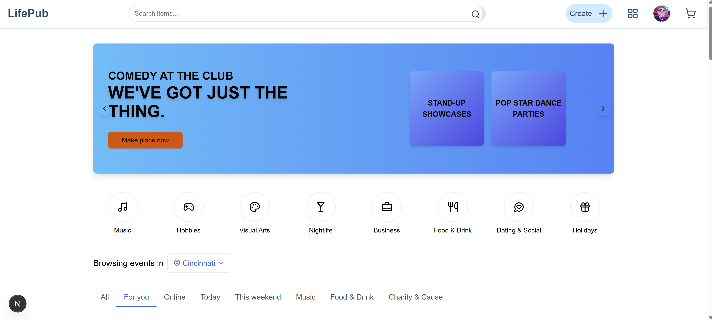
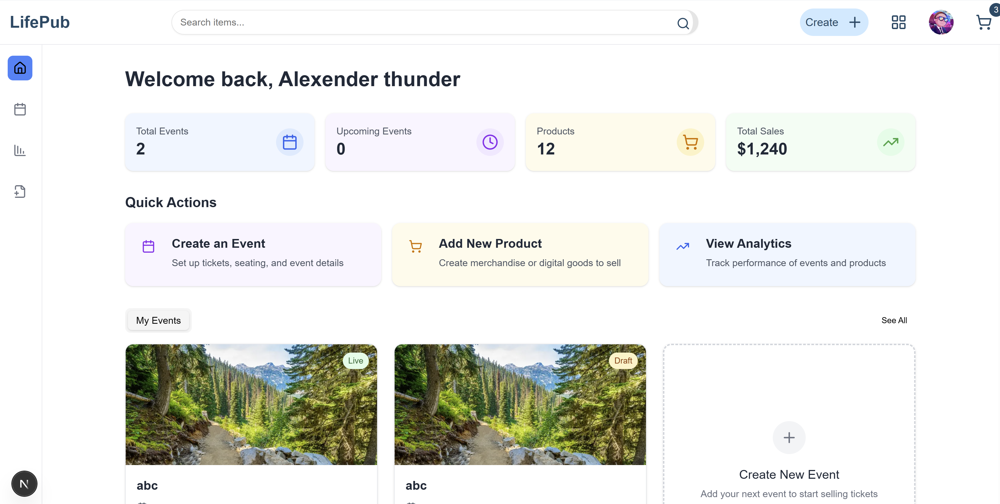
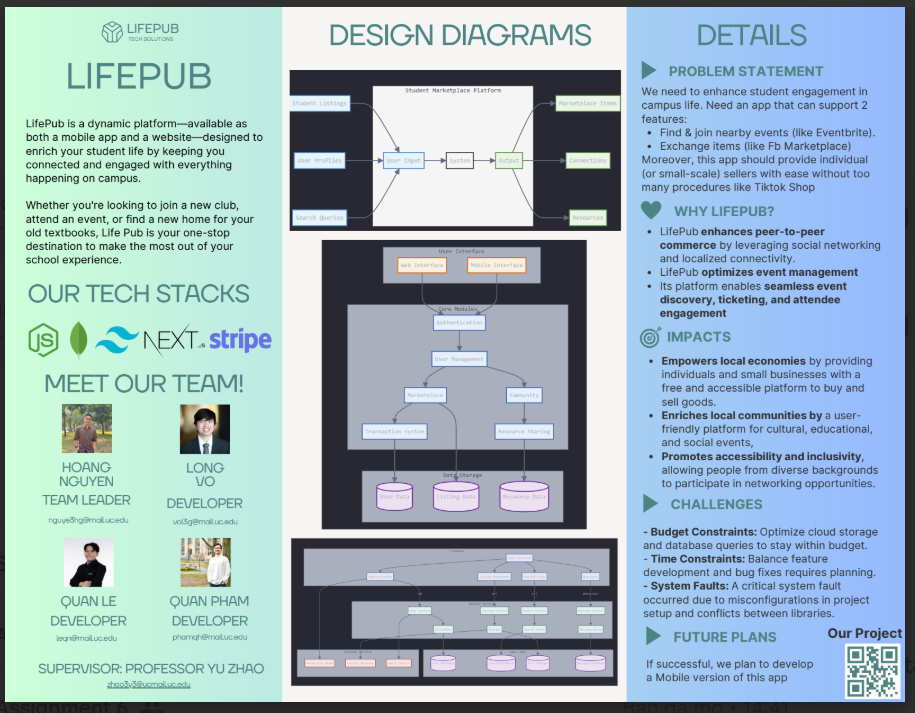

# Project Name: LifePub 

### 1. Project Description: 

Life Pub is a dynamic platform and it is a website—designed to enrich your student life by keeping you connected and engaged with everything happening on campus. Whether you're looking to join a new club, attend an event, or find a new home for your old textbooks, Life Pub is your one-stop destination to make the most out of your school experience.

Stay Engaged with Campus Activities: Life Pub provides real-time updates on school activities, clubs, and events, making it effortless for you to discover and participate in what's happening around you.

Connect Through Peer-to-Peer Exchanges: Life Pub's peer-to-peer marketplace allows students to exchange or pass on items like textbooks, equipment, and school merchandise. It's a sustainable way to save money, reduce waste, and help out fellow students.

Foster a Stronger Community: At its core, Life Pub is all about building connections. By bringing together various facets of campus life into one accessible platform, we aim to foster a vibrant and supportive student community where everyone can thrive.

### 2. User Interface
For more detail see this user manual with image of the application

[User Manual](https://docs.google.com/document/d/1UPYpGw8IojakOKmIpDG154LTZCH72kU0kI6L7zFRKaA/edit?usp=sharing)

*landing page*

*event creation page for seller*

### 3. Test Plans

Link to test plan https://docs.google.com/document/d/1vNS3mEVG18eDTFYcbdBctBfJNVSZ_po-tNbXryvhgCI/edit?usp=sharing

### 4. User Manual

All the user instruction and FAQ are documented here:

[User Manual](https://docs.google.com/document/d/1UPYpGw8IojakOKmIpDG154LTZCH72kU0kI6L7zFRKaA/edit?usp=sharing)

### 5.  Spring Final PPT Presentation, 

Presentation link is [here](https://docs.google.com/presentation/d/1kMsCP-yr7eLmIw3owozBxf2PejEByKcg2G89E939FXg/edit?usp=sharing)

### 6. Final Expo Poster

### 7. Assessments

**Initial Self-Assessments (fall semester)**

Quan Le: https://docs.google.com/document/d/1hQbV365ZZpOAT3V0a0dDD-z3xuq_cu1_6PxtNohWYOE/edit?usp=sharing

Long Vo: https://docs.google.com/document/d/1mVfOXcnEK43ZyxZ4KTXCkwdsOW5tnd6EnP02TQxXTwk/edit?usp=sharing

**Final Self-Assessments (spring semester, do not include confidentialTeam-Assessments)**

Quan Le - [Link to document](https://docs.google.com/document/d/1AaWwlaLDvCEsfrYhOUwm7zbKtyfQHlmrxlBxzmEqAYw/edit?usp=sharing) 

Long Vo - [Link to document](https://docs.google.com/document/d/1mVfOXcnEK43ZyxZ4KTXCkwdsOW5tnd6EnP02TQxXTwk/edit?usp=sharing)

### 8.  Summary of Hours and Justification (one per individual team member)

| Team Member | Hours (Fall) | Hours (Spring) | Total | Description |
|-------------|--------------|----------------|--------|-------------|
| Quan Le     | 60 hrs       | 50 hrs         | 110 hrs | Project Lead, Product Manager, Full stack, Documentation, Testing, for more info visit the assesment section  |
| Long Vo     | 45 hrs       | 45 hrs         | 90 hrs | Full Stack, Front End, Backend, CI/CD Integrations, for more info please visit the assessment section  |

### 9. Summary of Expenses
The expenses incur when we were testing with deployment which lead to some charges of around $5 but overall it doesn't cost a lot too make the application

### 10. Appendix

Link to miro board - [Link](https://miro.com/app/board/uXjVLo65xlo=/)

Resources we used to make the app:
- [AWS Elastic Beanstalk](https://aws.amazon.com/elasticbeanstalk/?trk=7251e6b1-d80c-4891-a63f-a6472921f7a3&sc_channel=ps&ef_id=Cj0KCQjwnui_BhDlARIsAEo9GusULuCJEWHu2VWnZjZFuqsj61_pk1Q5ut__LLWOKZQ6yjO9Uky53wIaAgiOEALw_wcB:G:s&s_kwcid=AL!4422!3!652240143514!e!!g!!amazon%20elastic%20beanstalk!19870609179!147363462876&gclid=Cj0KCQjwnui_BhDlARIsAEo9GusULuCJEWHu2VWnZjZFuqsj61_pk1Q5ut__LLWOKZQ6yjO9Uky53wIaAgiOEALw_wcB) 
- [AWS EC2](https://aws.amazon.com/pm/ec2/?trk=9cd376cd-1c18-46f2-9f75-0e1cdbca94c5&sc_channel=ps&ef_id=Cj0KCQjwnui_BhDlARIsAEo9GutgU8U9ODqkZIOLBh6dTx8yKaAJum30paf8RFQ4nPiv6d8JkzHoF9MaAvGgEALw_wcB:G:s&s_kwcid=AL!4422!3!651751059309!e!!g!!aws%20ec2!19852662176!145019189697&gclid=Cj0KCQjwnui_BhDlARIsAEo9GutgU8U9ODqkZIOLBh6dTx8yKaAJum30paf8RFQ4nPiv6d8JkzHoF9MaAvGgEALw_wcB)
- [Stripe Doc](https://docs.stripe.com/checkout/embedded/quickstart)
- [shadcn](https://ui.shadcn.com/docs)
- [nextjs auth](https://github.com/nextauthjs/next-auth)
- [stripe integration guide](https://www.youtube.com/watch?v=Sh_enHD6ssI)

--- 

# Fall 2024

### Task List
| Task ID | Task Description | Responsible | Priority | Status |
|---------|------------------|-------------|----------|--------|
| 1 | Specify the detailed requirements for the event tracking feature | Hoang Nguyen | High | |
| 2 | Design the database schema for storing event information | Quan Le | High | |
| 3 | Develop RESTful API endpoints for event CRUD operations | Long Vo | High | |
| 4 | Implement user authentication and authorization system | Quan Le | High | |
| 5 | Design the user interface for the event listing and detail pages | Quan Pham | Medium | |
| 6 | Develop frontend components for displaying events | Hoang Nguyen | Medium | |
| 7 | Integrate push notifications for upcoming events | Long Vo & Quan Pham | Low | |
| 8 | Research and select a suitable map API for displaying event locations | Hoang Nguyen & Quan Le | Low | |
| 9 | Implement geolocation-based event filtering | Long Vo | Medium | |
| 10 | Design the user interface for the free food tracking feature | Quan Pham | Medium | |
| 11 | Develop backend logic for managing and updating free food information | Quan Le | Medium | |
| 12 | Create frontend components for displaying and interacting with free food listings | Long Vo | Medium | |
| 13 | Specify the requirements for the marketplace feature | Hoang Nguyen | High | |
| 14 | Design the database schema for marketplace listings | Quan Le | High | |
| 15 | Develop API endpoints for creating, updating, and deleting marketplace listings | Quan Le & Long Vo | High | |
| 16 | Design the user interface for the marketplace feature | Quan Pham | Medium | |
| 17 | Implement frontend components for browsing and posting marketplace items | Quan Pham | Medium | |
| 18 | Develop a search and filter system for marketplace items | Quan Le | Medium | |
| 19 | Integrate a messaging system for marketplace users | Long Vo | Low | |
| 20 | Design and implement a user profile system | Quan Pham & Quan Le | Medium | |
| 21 | Develop a recommendation engine for events and marketplace items | Quan Le | Low | |
| 22 | Implement data analytics and reporting features | Hoang Nguyen & Long Vo | Low | |
| 23 | Conduct usability testing for all main features | Long Vo | High | |
| 24 | Optimize application performance and responsiveness | All team members | Medium | |
| 25 | Document the API and create user guides | Quan Pham | Medium | |
| 26 | Oversee project deadlines and team coordination | Hoang Nguyen | High | |
| 27 | Coordinate communication with the project advisor | Hoang Nguyen | Medium | |
| 28 | Keep track of all pull requests and ensure code quality | Long Vo | High | |
| 29 | Assign programming tasks to team members | Quan Le | High | |
| 30 | Create an overview of the application design in Figma | Quan Pham | High | |
| 31 | Maintain all project documentation and ensure deliverables are recorded | Quan Pham | High | |

Note: Priority levels (High, Medium, Low) have been assigned based on the typical importance of these tasks in a project lifecycle. The team should review and adjust these as needed. The Status column is left blank for the team to update as the project progresses.

### Timeline

Link to the Timeline: https://drive.google.com/file/d/1u4js-25v6d6zLAlpdISRgHBBA9TRQKFY/view?usp=sharing

### Effort Matrix

Link to the Effort Matrix:
https://docs.google.com/document/d/17PhEfPg8uCi_Xp-QmUqM_7modIzHADlYA24vwrh6nVU/edit?usp=drive_link

## ABET Concerns Essay (Assignment #7)

Link to the essay: 
https://drive.google.com/file/d/1u4js-25v6d6zLAlpdISRgHBBA9TRQKFY/view?usp=sharing

## PPT Slideshow (includes ABET Concerns) (Assignment #8)

Link to google doc:
https://docs.google.com/presentation/d/1kMsCP-yr7eLmIw3owozBxf2PejEByKcg2G89E939FXg/edit?usp=sharing

## Self-Assessment Essays (Assignment #3)

Quan Le: https://docs.google.com/document/d/1hQbV365ZZpOAT3V0a0dDD-z3xuq_cu1_6PxtNohWYOE/edit?usp=sharing

Long Vo: https://docs.google.com/document/d/1mVfOXcnEK43ZyxZ4KTXCkwdsOW5tnd6EnP02TQxXTwk/edit?usp=sharing

## Professional Biographies  (Assignment #1)

Quan Le:

Email: leqn@mail.uc.edu 

portfolio: leqndev.com

**Company 1**: Meta

Experience: Software Engineer Intern

**Company 2**: University of Cincinnati

Experience: Machine Learning Researcher

Project Sought: 

Want to work on project that utilize cloud technologies with machine learning operations to build a project that can solve a business needs or a pain point for end-users

*NEED TO FILL IN YOUR BIOGRAPHIES HERE*

Hoang Nguyen  
Nguye3hg@mail.uc.edu  

**CO-OP WORK EXPERIENCE**

**Software Engineering Co-op, IRAS Lab, Cincinnati, OH**
*May 2024 – Aug 2024*  
- Developed and deployed a dynamic website using React, improving research project access and lab efficiency.  
- Leveraged AWS Amplify for seamless deployment, incorporating CloudFront and S3, resulting in a 40% reduction in content delivery time as measured by CloudWatch.  
- Collaborated with lab members to gather requirements and ensure the website met all technical and user experience standards, leading to a 25% increase in user engagement.  

**Front-End Developer, Pam Air, Ha Noi, Viet Nam**  
*May 2023 – Aug 2023*  
- Implemented a web app using Next.js and Python with a team of 4 to generate accurate and synchronized Air Quality Index (AQI) readings for Saigon and Hanoi within 12 hours or 3 days.  
- Developed a comprehensive web application comprising Management and API routes to effectively communicate and disseminate updates to employees across 10 different departments.  
- Managed software for 400+ monitoring stations across 63 locations in Vietnam, focusing on feature integration and optimization.  

**CS Intern, FPT Software, Ha Noi, Viet Nam**  
*Jan 2023 – May 2023*  
- Collaborated with a team of 17 individuals in 3 months to develop an internal management system for Singapore Airlines, using technologies such as React, Next.js, and Prisma.  
- Reduced 60% paperwork by successfully implementing a new policy route through collaboration with both frontend and backend teams.  
- Minimized customer complaints by 15% for Singapore Airlines within a 4-month period by improving scalability.  

**SKILLS**  
- **Skills**: Data Structure, Data Analysis, Data Visualization, Web Development, Software Development  
- **Programming Languages**: JavaScript, TypeScript, Python, SQL, CSS, HTML5, C++  
- **Database & Tools**: Git, AWS Services, Node.js, Next.js, React, Firebase, TensorFlow, Keras, Express, Postman, PostgreSQL  

**AREA OF INTEREST**  
- Cloud computing  
- Web Development  
- Machine learning/AI
- 
**PROJECT SOUGHT**  
- **AI Finance Tracker**: An app that analyzes expenses, offers budgeting tips, and predicts spending using AI models on AWS.  
- **Smart Health Monitor**: A cloud-based system that tracks patient vitals using IoT, with AI detecting anomalies and sending alerts.  
- **Automated Customer Support Bot**: A chatbot using cloud AI to handle common customer queries, reducing support workload and response times.  

## Budget
- expenses to date or statement that there have not been any.

We have mostly used free resources or tier from AWS, Azure and free resources on youtube so there has not been any extra cost yet. But using ClaudeAI api and google agent there has been some minimal cost 

- show monetary value of donated items and donation sources.

N/A

## Appendix
- include appropriate references, citations, links to code repositories, and meeting notes.
- there should be evidence justifying 45 hours of effort for each team member.
